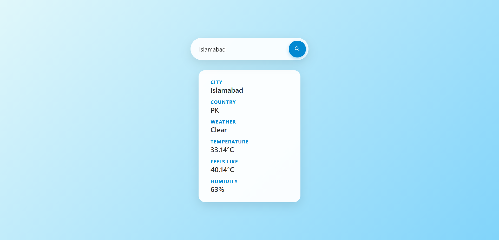

# Python Weather App

A minimal full-stack weather application built with FastAPI and vanilla JavaScript. It retrieves current weather data for any city using the OpenWeatherMap API.

## Features

- Search current weather by city name
- Live data from OpenWeatherMap (geocoding + current weather endpoints)
- Input validation with descriptive error responses
- Responsive frontend
- API key managed through environment variables
- CORS enabled for frontend-backend communication

## Tech Stack

**Backend**

- FastAPI
- Uvicorn
- requests
- python-dotenv

**Frontend**

- HTML, CSS, JavaScript (no frameworks)

Tooling:

- uv (package management)
- Ruff (linting)

**External Service**

- OpenWeatherMap API

## Prerequisites

- Python 3.11 or higher
- uv package manager
- A free API key from OpenWeatherMap (https://openweathermap.org/api)

## Installation

- Clone the repository:

```bash
git clone https://github.com/RafeyAhmed01/Weather-App
cd Weather-App
```
- Install Dependencies

```bash
uv sync
```
- Create a .env file in the project root with your API key with the key "API_KEY"

## Running the Application

```bash
uv run uvicorn main:app --reload
```

- The API will be available at http://127.0.0.1:8000
- Open templates/index.html in a browser to use the frontend. If using VS Code Live Server, the page might be served at http://127.0.0.1:5500/templates/index.html

## API Reference

```bash 
GET /api/v1/{city_name}
```
- Returns current weather data for the specified city.

**Example URL**
```bash
curl http://localhost:8000/api/v1/London
```

**Example Response**
```bash
{
  "name": "London",
  "country": "GB",
  "weather": "Rain",
  "temperature": 16.09,
  "feels_like": 16.05,
  "humidity": 88
}
```

**Error Responses**
```bash
400 # Empty City name
404 # City was not found
```

**Notes on Geocoding Behavior**

The OpenWeatherMap geocoding endpoint performs fuzzy matching. This can produce unexpected results:

- A query for a non-existent city may return the closest match (for example, Narnia returns Narni, a town in Italy).
- A query may resolve to a landmark or neighborhood rather than the city itself (for example, Paris has returned Palais-Royal in some cases).
- Typos may silently resolve to a different city (for example, Londn returns London).

The application currently returns the first exact-name match when available, otherwise the top result from the geocoding API. Consumers of this API should be aware that the returned city may not exactly match the query string.

## License 

MIT

## Screenshot

